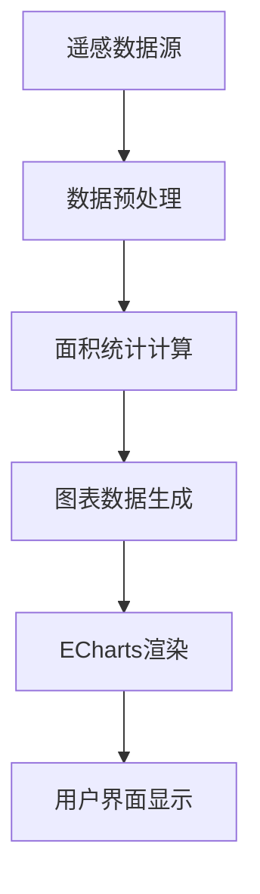

# 数据看板功能批注 - 主页面作物分布 (index.html)

## 📋 页面概览

**页面功能**: 作物分布监测功能
**主要作用**: 展示农田作物种植分布、面积统计和结构分析
**技术栈**: Cesium.js 地图引擎 + ECharts 图表库 + 科技感UI设计

## 🎯 核心功能模块

### 1. 系统横幅模块 (system-header)

#### 功能说明
- **系统状态指示器**: 实时显示系统运行状态，绿色圆点表示正常运行
- **系统标题**: "临夏县卫星遥感平台" 中英文双语显示
- **时间显示**: 实时更新的时间和日期信息
- **用户信息区**: 用户头像、姓名、角色和下拉菜单

#### 实现原理
```javascript
// 时间更新逻辑 (main.js)
function updateTime() {
    const now = new Date();
    const timeElement = document.getElementById('current-time');
    const dateElement = document.getElementById('current-date');
    
    timeElement.textContent = now.toLocaleTimeString('zh-CN');
    dateElement.textContent = now.toLocaleDateString('zh-CN', { weekday: 'long' });
}
setInterval(updateTime, 1000); // 每秒更新
```

#### 数据来源
- 系统状态: 前端模拟数据，实际部署时可连接服务器监控接口
- 时间显示: 客户端本地时间
- 用户信息: 静态配置数据

### 2. 功能切换栏模块 (function-switch-bar)

#### 功能说明
- **主功能按钮**: 5个单选按钮，切换不同页面功能
  - 🌾 作物分布 (当前页面)
  - 📊 长势分析 (growth-analysis.html)
  - 📈 产量预估 (yield-estimation.html)
  - 🌤️ 气象监测 (weather-monitoring.html)
  - ⚠️ 灾害定损 (disaster-monitoring.html)

- **叠加功能按钮**: 2个多选按钮，开启附加功能
  - 📱 设备监控 (覆盖设备位置信息)
  - 🌾 作物选择 (作物图层筛选器)

#### 实现原理
```javascript
// 页面跳转逻辑 (main.js)
const pageMapping = {
    'crop-distribution': 'index.html',
    'growth-analysis': 'growth-analysis.html',
    'yield-estimation': 'yield-estimation.html',
    'weather-monitoring': 'weather-monitoring.html',
    'disaster-monitoring': 'disaster-monitoring.html'
};
```

#### 交互逻辑
- 主功能按钮: 单选模式，点击后跳转到对应页面
- 叠加功能按钮: 多选模式，可同时开启多个功能

### 3. 数据面板模块

#### 3.1 左侧面板 - 种植结构分析

##### (1) 种植结构对比柱状图
**功能**: 显示近三年(2022-2024)各作物种植面积变化趋势

**数据结构**:
```javascript
// dashboard-charts.js
const plantingData = [
    { year: '2022', wheat: 1180, corn: 890, pepper: 425, other: 320 },
    { year: '2023', wheat: 1220, corn: 920, pepper: 445, other: 285 },
    { year: '2024', wheat: 1256, corn: 986, pepper: 453, other: 275 }
];
```

**技术实现**:
- ECharts 横向柱状图
- 支持鼠标悬浮查看详细数据
- 自动计算同比增减率
- 响应式图表大小调整

##### (2) 作物类型分布桑基图
**功能**: 展示作物轮作流转关系和面积迁移趋势

**实现原理**:
```javascript
// 桑基图配置
series: [{
    type: 'sankey',
    data: [
        {name: '油菜', value: 120},
        {name: '娃娃菜', value: 54},
        {name: '小麦', value: 180},
        {name: '玉米', value: 68}
    ],
    links: [
        {source: '油菜', target: '娃娃菜', value: 54},
        {source: '小麦', target: '玉米', value: 68}
    ]
}]
```

##### (3) 数据更新状态面板
**功能**: 显示数据处理进度和系统状态信息

**显示内容**:
- 最后遥感数据时间: 2024-01-12 10:30
- 数据处理进度: 85% (进度条显示)
- 数据质量评估: 实时状态
- 更新日志记录

#### 3.2 右侧面板 - 作物分布监测

##### (1) 作物面积环形图
**功能**: 环形图展示各作物面积占比

**数据来源**:
```javascript
const cropAreaData = [
    { value: 1256, name: '小麦', itemStyle: { color: '#4CAF50' } },
    { value: 986, name: '玉米', itemStyle: { color: '#FFC107' } },
    { value: 453, name: '辣椒', itemStyle: { color: '#FF5722' } },
    { value: 275, name: '其他', itemStyle: { color: '#9E9E9E' } }
];
```

**交互功能**:
- 点击扇形区域查看作物详情
- 鼠标悬浮显示精确面积和百分比
- 支持图例点击隐藏/显示

##### (2) 大棚专项统计卡
**功能**: 专门统计设施农业数据

**统计指标**:
- 大棚总面积: 186 亩 (占总监测面积 6.3%)
- 大棚内作物分布:
  - 🌶️ 辣椒: 35%
  - 🥒 黄瓜: 28%
  - 🍅 西红柿: 37%

##### (3) 区域面积汇总看板
**功能**: 显示监测区域整体统计信息

**关键指标**:
- 总监测面积: 2,970 亩
- 覆盖范围: 12个行政村
- 作物种类数: 8种
- 地块总数: 324个

### 4. 地图容器模块 (cesium-container)

#### 功能说明
- **Cesium 2D地图**: 基于Cesium引擎的高性能地图显示
- **多图层支持**: 标准地图、卫星影像切换
- **作物分布图层**: 叠加显示作物种植分布数据
- **交互功能**: 缩放、平移、图层控制

#### 技术实现
```javascript
// cesium-map.js
function initCesiumMap() {
    cesiumViewer = new Cesium.Viewer('cesium-container', {
        terrainProvider: Cesium.createWorldTerrain(),
        imageryProvider: new Cesium.OpenStreetMapImageryProvider(),
        homeButton: false,
        fullscreenButton: false,
        vrButton: false
    });
}
```

#### 图层管理
- **基础图层**: OpenStreetMap标准地图
- **影像图层**: Bing Maps/Esri卫星影像
- **作物图层**: 矢量数据叠加显示
- **设备图层**: 监测设备位置标注

## 🎨 UI设计特性

### 毛玻璃效果
```css
.glass-panel {
    background: rgba(255, 255, 255, 0.1);
    backdrop-filter: blur(10px);
    border: 1px solid rgba(255, 255, 255, 0.2);
    border-radius: 10px;
}
```

### 科技感动画
- 系统状态指示器呼吸效果
- 用户头像光环动画
- 时间显示发光效果
- 背景网格移动动画

### 响应式设计
- 支持1920×1080标准分辨率优化
- 图表自动适应容器大小
- 窗口大小改变时自动重新调整

## 📊 数据流架构

### 数据来源
1. **模拟数据**: 当前使用前端生成的模拟数据
2. **扩展接口**: 预留API接口对接真实遥感数据
3. **本地存储**: 用户设置和临时数据缓存

### 数据处理流程


### 更新机制
- **实时更新**: 系统状态、时间显示每秒更新
- **定时更新**: 遥感数据每小时更新一次
- **手动刷新**: 用户可手动触发数据刷新

## 🔧 技术栈详解

### 前端框架
- **HTML5**: 语义化结构
- **CSS3**: 现代样式和动画
- **JavaScript ES6**: 模块化代码组织

### 可视化库
- **ECharts 5.4.3**: 数据图表渲染
- **Cesium 1.110**: 3D地球和2D地图
- **自定义组件**: 科技感UI组件

### 开发工具
- **模块化设计**: 功能分离，便于维护
- **配置化数据**: 便于调整和扩展
- **错误处理**: 完善的异常捕获机制

## 🚀 性能优化

### 图表优化
- 图表懒加载，提升页面初始化速度
- 数据变更时增量更新，避免全量重绘
- 图表销毁机制，防止内存泄漏

### 地图优化
- 分级加载，根据缩放级别显示详细程度
- 图层缓存，减少重复数据请求
- 视野范围裁剪，仅加载可见区域数据

## 🎯 业务价值

### 决策支持
- **宏观分析**: 整体作物分布和种植结构一目了然
- **精准统计**: 精确到亩的面积统计数据
- **趋势预测**: 通过历史数据分析未来趋势

### 管理效率
- **可视化管理**: 直观的图表和地图展示
- **实时监控**: 及时掌握农业生产动态
- **数据驱动**: 基于数据的科学决策

### 用户体验
- **操作简单**: 直观的用户界面设计
- **响应迅速**: 优化的性能表现
- **信息丰富**: 多维度的数据展示

## 📝 扩展建议

### 功能扩展
1. **历史数据对比**: 增加多年度数据对比分析
2. **预警系统**: 集成作物长势预警功能
3. **报表导出**: 支持数据报表生成和导出
4. **移动端适配**: 开发移动端专用界面

### 技术优化
1. **API集成**: 对接真实的遥感数据API
2. **数据库支持**: 添加后端数据存储
3. **用户权限**: 实现多用户权限管理
4. **缓存机制**: 优化数据加载性能

---

**文档版本**: v1.0
**创建时间**: 2025-01-17
**更新时间**: 2025-01-17
**维护人员**: 系统开发团队