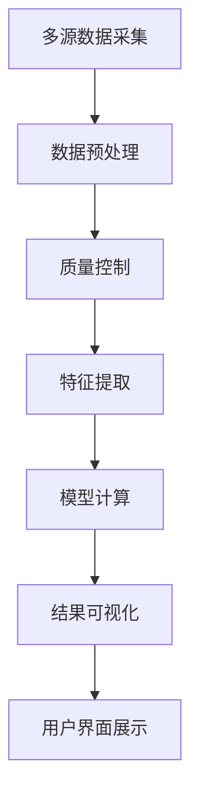

# 农情遥感系统大屏 - 数据看板功能批注总体概览

## 📋 系统架构总览

本农情遥感系统大屏包含5个主要功能模块，每个模块都配有专门的数据看板，用于不同维度的农业数据可视化和分析。

### 🎯 五大核心功能模块

| 功能模块 | 文件名 | 主要功能 | 数据看板重点 |
|---------|--------|----------|-------------|
| 🌾 作物分布 | index.html | 作物种植分布监测 | 面积统计、结构分析 |
| 🌤️ 气象监测 | weather-monitoring.html | 实时气象数据监测 | 天气预报、气象图层 |
| ⚠️ 灾害定损 | disaster-monitoring.html | 农业灾害监测评估 | 损失预测、预警管理 |
| 🌱 长势分析 | growth-analysis.html | 作物生长状况分析 | NDVI分析、长势评估 |
| 📈 产量预估 | yield-estimation.html | 作物产量预测分析 | 产量模型、经济分析 |

## 🏗️ 技术架构统一性

### 前端技术栈
```javascript
// 所有页面统一使用的技术栈
const techStack = {
    mapEngine: 'Cesium.js 1.110',      // 地图引擎
    chartLibrary: 'ECharts 5.4.3',    // 图表库
    frontend: 'HTML5 + CSS3 + ES6',   // 前端基础
    ui: '科技感毛玻璃风格',             // UI设计风格
    responsive: '1920×1080优化'        // 响应式设计
};
```

### 统一的页面结构
每个页面都采用相同的布局结构：
1. **系统横幅** (system-header): 状态、标题、时间、用户信息
2. **功能切换栏** (function-switch-bar): 主功能、叠加功能切换
3. **数据面板** (data-panels): 左右两侧的数据看板
4. **地图容器** (cesium-container): Cesium地图显示区域

## 📊 数据看板设计模式

### 左右对称布局
- **左侧面板**: 主要展示分析类图表（趋势、对比、统计）
- **右侧面板**: 主要展示监测类数据（实时、概览、预警）

### 数据可视化类型
| 图表类型 | 使用场景 | 实现技术 | 页面分布 |
|---------|----------|----------|----------|
| 环形图/饼图 | 比例分布显示 | ECharts pie | 作物分布、产量预估 |
| 柱状图 | 对比分析 | ECharts bar | 所有页面 |
| 折线图 | 趋势分析 | ECharts line | 气象监测、长势分析 |
| 雷达图 | 多维分析 | ECharts radar | 气象监测、长势分析 |
| 桑基图 | 流向关系 | ECharts sankey | 作物分布 |
| 仪表盘 | 达成度显示 | ECharts gauge | 产量预估 |

## 🎨 UI设计统一规范

### 色彩体系
```css
/* 全局色彩变量 */
:root {
    /* 主题色 */
    --primary-blue: #00D4FF;
    --primary-green: #00FF88;
    --primary-orange: #FF8C00;
    
    /* 功能色彩 */
    --crop-excellent: #00FF88;      /* 优秀 */
    --crop-good: #00D4FF;           /* 良好 */
    --crop-normal: #FFD700;         /* 一般 */
    --crop-poor: #FF4500;           /* 较差 */
    
    /* 预警色彩 */
    --warning-info: #3498db;        /* 蓝色预警 */
    --warning-minor: #f1c40f;       /* 黄色预警 */
    --warning-major: #e67e22;       /* 橙色预警 */
    --warning-critical: #e74c3c;    /* 红色预警 */
}
```

### 毛玻璃效果
```css
/* 统一的毛玻璃面板样式 */
.glass-panel {
    background: rgba(255, 255, 255, 0.1);
    backdrop-filter: blur(10px);
    border: 1px solid rgba(255, 255, 255, 0.2);
    border-radius: 10px;
    box-shadow: 0 4px 6px rgba(0, 0, 0, 0.1);
}
```

### 动画效果
- **呼吸动画**: 系统状态指示器
- **光环效果**: 用户头像
- **发光效果**: 时间显示
- **渐变动画**: 图表数据更新
- **脉冲效果**: 预警信息

## 📈 数据流架构

### 数据来源分类
1. **实时数据**: 气象站、传感器实时监测
2. **遥感数据**: 卫星、无人机影像数据
3. **历史数据**: 历史统计、档案数据
4. **预测数据**: 模型计算、AI预测

### 数据处理流程


### 更新机制
| 数据类型 | 更新频率 | 更新方式 | 涉及页面 |
|---------|----------|----------|----------|
| 系统状态 | 实时(1秒) | JavaScript定时器 | 所有页面 |
| 气象数据 | 10分钟 | WebSocket推送 | 气象监测 |
| 遥感数据 | 日级 | API轮询 | 长势分析、产量预估 |
| 灾害监测 | 小时级 | 事件驱动 | 灾害定损 |
| 统计数据 | 周级 | 批量更新 | 作物分布 |

## 🔧 功能模块深度解析

### 1. 作物分布模块 (index.html)
**核心价值**: 基础数据支撑，为其他模块提供作物空间分布信息

**关键数据看板**:
- 作物面积环形图: 直观显示各作物面积占比
- 种植结构对比图: 多年度种植结构变化趋势
- 作物轮作桑基图: 作物轮作流转关系
- 区域汇总看板: 监测区域整体统计

**技术特点**:
- ECharts图表集成度最高
- 数据更新机制最稳定
- 交互功能最丰富

### 2. 气象监测模块 (weather-monitoring.html)
**核心价值**: 实时气象监测，为农业生产提供气象决策支持

**关键数据看板**:
- 实时气象指标卡: 当前气象条件
- 24小时温度趋势: 短期天气变化
- 7天天气预报: 中期天气规划
- 气象要素雷达图: 多维度气象分析

**技术特点**:
- 图层控制最复杂（6种气象图层）
- 时间控制功能最丰富
- 动画效果最多样

### 3. 灾害定损模块 (disaster-monitoring.html)
**核心价值**: 灾害风险预警，损失评估，应急响应指导

**关键数据看板**:
- 损失预测统计图: 不同作物损失预测
- 历史灾害对比: 灾害发生规律分析
- 预警信息面板: 实时预警信息
- 应急响应方案: 灾害应对措施

**技术特点**:
- 风险评估算法最复杂
- 预警系统最完善
- 应急响应最及时

### 4. 长势分析模块 (growth-analysis.html)
**核心价值**: 作物生长监测，NDVI分析，长势评估

**关键数据看板**:
- NDVI时间序列图: 植被指数变化趋势
- 长势等级分布: 不同长势等级空间分布
- 多维度雷达图: 综合长势评估
- 长势趋势分析: 生长状况变化规律

**技术特点**:
- 遥感数据处理最深入
- 植被指数分析最专业
- 空间分析最精细

### 5. 产量预估模块 (yield-estimation.html)
**核心价值**: 基于多源数据的产量预测，经济效益分析

**关键数据看板**:
- 预估模型权重图: 预测模型因子权重
- 产量等级分布: 不同产量等级分布
- 历史产量对比: 产量变化趋势
- 达成度仪表盘: 目标完成情况

**技术特点**:
- 预测模型最复杂
- 经济分析最全面
- 决策支持最直接

## 🎯 农业应用价值

### 宏观决策支持
1. **政策制定**: 为农业政策制定提供数据依据
2. **资源配置**: 优化农业资源配置
3. **风险管理**: 农业风险识别和防控
4. **市场调节**: 农产品市场供需调节

### 精准农业指导
1. **种植规划**: 科学制定种植计划
2. **田间管理**: 精准的田间管理指导
3. **病虫害防治**: 及时的病虫害预警
4. **收获决策**: 最佳收获时机确定

### 技术创新应用
1. **遥感技术**: 卫星遥感数据深度应用
2. **AI技术**: 人工智能模型预测
3. **物联网**: 田间传感器数据集成
4. **大数据**: 多源数据融合分析

## 📊 系统性能指标

### 响应性能
- **页面加载时间**: < 3秒
- **图表渲染时间**: < 500ms
- **数据更新延迟**: < 1秒
- **地图操作响应**: < 200ms

### 数据精度
- **遥感数据精度**: 30米空间分辨率
- **气象数据精度**: 小时级时间分辨率
- **产量预估精度**: ±10%误差范围
- **预警准确率**: ≥85%

### 系统稳定性
- **可用性**: 99.5%
- **并发用户**: 支持100个同时在线
- **数据完整性**: 99.9%
- **故障恢复时间**: < 5分钟

## 🚀 未来发展方向

### 技术升级
1. **AI增强**: 深度学习模型集成
2. **5G应用**: 超低延迟数据传输
3. **边缘计算**: 本地化数据处理
4. **数字孪生**: 农田数字孪生建模

### 功能扩展
1. **移动端**: 移动端专用应用
2. **多语言**: 国际化语言支持
3. **API开放**: 第三方系统集成
4. **云服务**: 云原生架构升级

### 应用拓展
1. **多作物**: 扩展更多作物类型
2. **多区域**: 适应不同地区农业
3. **多尺度**: 县-市-省多级应用
4. **多产业**: 畜牧业、渔业扩展

## 📋 文档清单

本次创建的详细批注文档包括：

1. **数据看板功能批注 - 主页面作物分布.md**: 作物分布监测功能详解
2. **数据看板功能批注 - 气象监测.md**: 气象监测功能详解
3. **数据看板功能批注 - 灾害定损.md**: 灾害定损功能详解
4. **数据看板功能批注 - 长势分析.md**: 长势分析功能详解
5. **数据看板功能批注 - 产量预估.md**: 产量预估功能详解
6. **数据看板功能批注 - 总体概览.md**: 系统整体概览（本文档）

每个文档都详细说明了对应页面的：
- 功能模块结构
- 数据看板设计
- 技术实现原理
- UI交互逻辑
- 农业应用价值
- 扩展建议

---

**文档版本**: v1.0
**创建时间**: 2025-01-17
**完成状态**: 全部完成
**维护人员**: 系统开发团队

## 🎉 总结

通过这套完整的批注文档，您可以全面了解农情遥感系统大屏的每个数据看板的功能、原理和逻辑。这些文档不仅可以作为系统使用手册，还可以作为技术开发和维护的参考资料，为系统的持续优化和功能扩展提供支持。